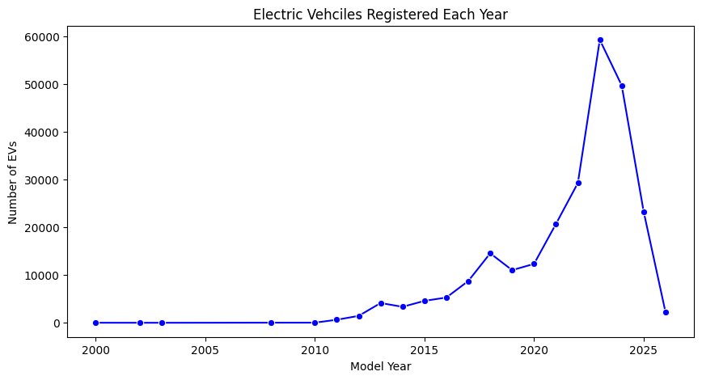
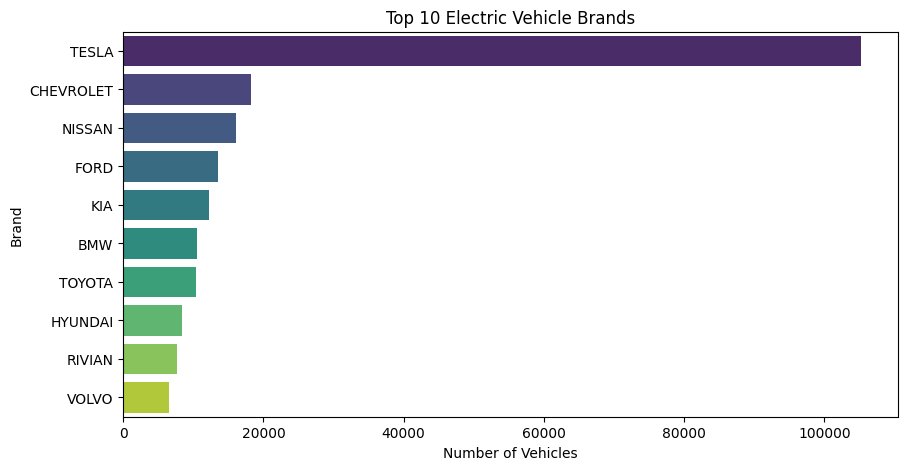
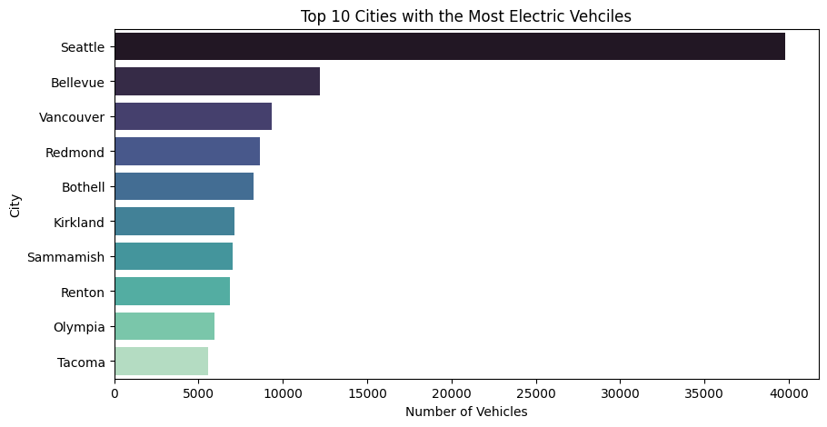
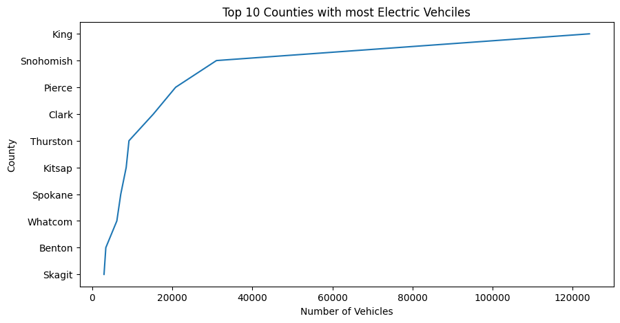
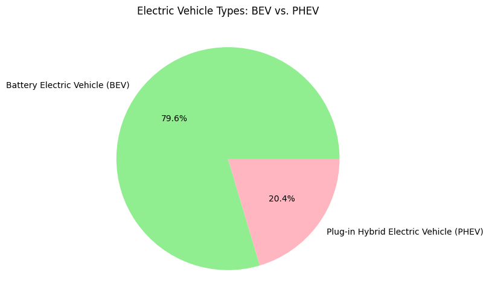
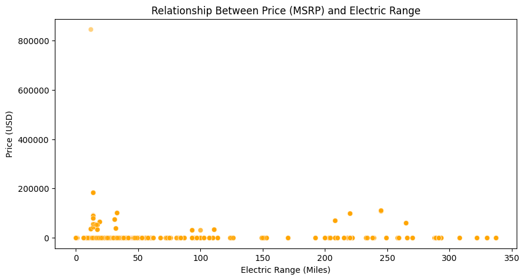
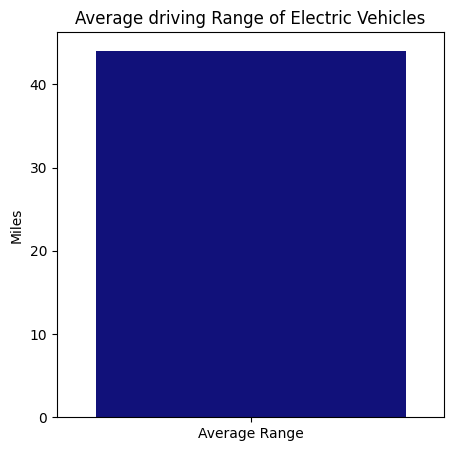
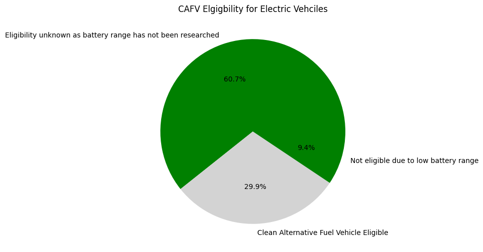
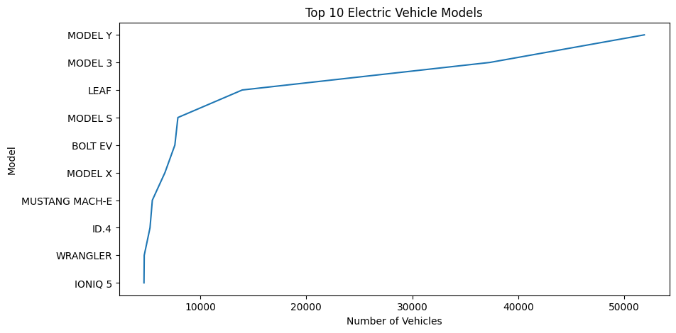
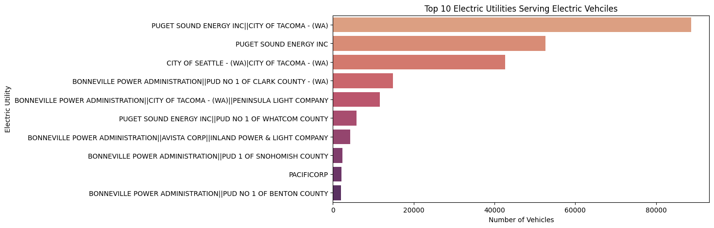

## Repository name
Your repostiory should be named something like 'async-final-project-pruple-Abdulrahman'
Example: `async-final-project-teal-Anas`
# Test

## Dataset
[Eclectric Vehicle Population](https://www.example.com/link-to-dataset)

## Why did I chose this dataset?

The reason I chose this dataset was because of my intrest in Electrical vehicles and how well they are spreading at the moment. I wanted to compare and contrast different electric cars to see the difference and how fast and suitable they are, as I wish to purchase an electric can in the future for myself.

## Progress
- [+ ] Picked dataset
- [ ] Defined 10 questions
- [ ] Answered 10 questions using Pandas
- [ ] Added at least one data visualization (using Matplotlib and/or Seaborn) to each single question
- [ ] Prepared presentation slides to present at graduation

## Questions
- [ ] Question 1: How many electric vehicles are registered each year?
  - Answer: Electric vehcile registerations have grown rapidly sicne around 2015
  - Visualization: 
  

- [ ] Question 2: Which electric vehicle brand are the most popular? 
  - Answer: Number #1 is Tesla
  - Visualization:
  

- [ ] Question 3: Whcih citites have the most electric vehciles?
  - Answer: The city with the highest electric vehciles is Seattle
  - Visualization: 
  

- [ ] Question 4: Which counties have the most electric vehicles?
  - Answer: The top 3 are: King county, Snohomish county, Pierce county
  - Visualization: 

- [ ] Question 5: Are most electric vehicles battery only (BEV) or plug in hybrids (PHEV)?
  - Answer: 
  - Visualization: Most Electric Vehicles are battery only (BEV) but there are a few that are plug in hybrids
  

- [ ] Question 6: What's the relationship between price and electric range?
  - Answer: The standard is that higher electric range generally connects with higher MSPR. 
  - Visualization: 
  

- [ ] Question 7: What is the averge driving range of electric vehicles?
  - Answer: Averge Driving Range: 44.073002 miles
  - Visualization: 

- [ ] Question 8: How many EVs are eligible for clean alternative fuel vehicle?
  - Answer: Number of eligible EVs: 74987
  - Visualization: 
  

- [ ] Question 9: Which are the most common electric vehicle models?
  - Answer: Model
MODEL Y           51903
MODEL 3           37334
LEAF              13959
MODEL S            7883
BOLT EV            7598
MODEL X            6660
MUSTANG MACH-E     5472
ID.4               5252
WRANGLER           4706
IONIQ 5            4682
  - Visualization:
  

- [ ] Question 10: Which electric utility companies serve the most electric vehicles?
  - Answer: Puget Sound Energy, Pacific Gas and Electric, and Seattle City Light are usually the top utilities serving Electric Vehicles. 
  - Visualization: 
  